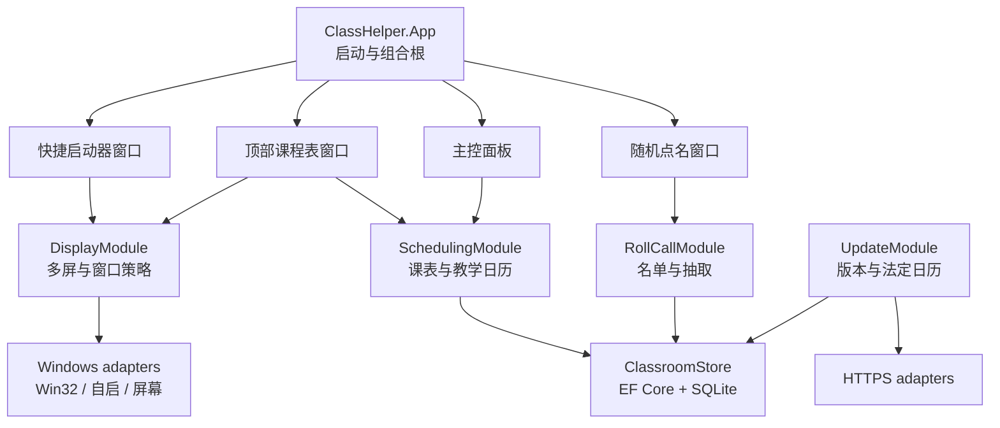

# 课堂助手技术设计

> 状态：已确认  
> 日期：2026-08-08  
> 适用范围：首个 Windows 版本

## 结论

采用一个自包含的 64 位 Windows 桌面进程：**C# + .NET 10 LTS + WPF**。业务数据使用 **EF Core 10 + SQLite**，窗口能力通过 **Win32** 补足，主控面板使用 **MVVM Toolkit**，安装包由 **WiX Toolset** 生成标准 MSI。

不建设服务端，不引入 Web 前端运行时，不使用跨平台 UI 框架。应用启动和核心功能不等待网络。

## 技术栈

| 关注点 | 选择 | 说明 |
|---|---|---|
| 语言与运行时 | C#、.NET 10 LTS、`win-x64` | .NET 10 支持到 2028-11；发布为 self-contained，教室电脑无需预装运行时 |
| 桌面 UI | WPF、XAML | 透明无边框、数据绑定、多窗口和桌面互操作成熟 |
| UI 模式 | CommunityToolkit.Mvvm | 只用于可观察状态和命令，不让 ViewModel 承担业务规则 |
| 应用生命周期 | Microsoft.Extensions.Hosting 10.x | 统一依赖注入、配置、日志和优雅退出 |
| Windows 互操作 | Microsoft.Windows.CsWin32 + 必要的 WPF HWND 互操作 | 编译期生成强类型 Win32 绑定，无额外运行时 |
| 数据库 | SQLite + Microsoft.EntityFrameworkCore.Sqlite 10.x | 单机、事务化、可迁移，适合共享的小型结构化数据 |
| Excel 导入 | ClosedXML | 直接读取 `.xlsx`，不依赖安装 Excel；CSV 使用 .NET 自带解析能力 |
| JSON | System.Text.Json | 用户偏好、更新清单和法定日历数据包 |
| HTTP | `HttpClient` | 只获取版本清单和法定日历数据包 |
| 日志 | Microsoft.Extensions.Logging + Serilog 文件输出 | 本地滚动日志；禁止记录学生姓名、学号、课程表正文和设备标识 |
| 测试 | xUnit v3、Microsoft.Extensions.TimeProvider.Testing | 课程周期和当前节次使用可控时间进行确定性测试 |
| 安装 | WixToolset.Sdk 7.x、MSI | 整机安装、共享目录 ACL、静默部署、升级与卸载 |
| CI | GitHub Actions Windows runner | restore、build、test、publish、构建 MSI；发布阶段再签名 |

选择依据：

- WPF 是 .NET 的 Windows 专用桌面 UI 框架，原生提供透明无边框和置顶窗口能力。[WPF 概览](https://learn.microsoft.com/en-us/dotnet/desktop/wpf/overview/)、[WPF 窗口](https://learn.microsoft.com/en-us/dotnet/desktop/wpf/windows/)
- .NET 可以通过 P/Invoke 访问 Win32；CsWin32 从 Windows 元数据生成强类型绑定，减少手写声明错误。[P/Invoke](https://learn.microsoft.com/en-us/dotnet/standard/native-interop/pinvoke)、[CsWin32](https://github.com/microsoft/CsWin32)
- .NET 10 是 LTS 版本。[.NET 支持策略](https://learn.microsoft.com/en-us/dotnet/core/releases-and-support)
- .NET 只对仍处于操作系统生命周期内的 Windows 版本提供正式支持；Windows 10 的验证范围必须区分 LTSC、ESU 与已停服版本。[.NET 10 支持的操作系统](https://github.com/dotnet/core/blob/main/release-notes/10.0/supported-os.md)
- Generic Host 提供统一的依赖注入、配置、日志和生命周期管理。[.NET Generic Host](https://learn.microsoft.com/en-gb/dotnet/core/extensions/generic-host)
- MVVM Toolkit 由 Microsoft 维护并支持 WPF。[MVVM Toolkit](https://learn.microsoft.com/en-us/dotnet/communitytoolkit/mvvm/)
- EF Core 官方维护 SQLite provider。[EF Core SQLite](https://learn.microsoft.com/en-us/ef/core/providers/sqlite/)
- ClosedXML 可以在未安装 Excel 的环境中读取 `.xlsx`，采用 MIT 许可证。[ClosedXML](https://docs.closedxml.io/en/latest/)
- WiX 使用 SDK 风格项目生成标准 MSI。[WiX MSBuild](https://docs.firegiant.com/wix/tools/msbuild/)

## 运行拓扑

一个 Windows 登录会话中只运行一个 ClassHelper 进程。进程拥有多个 WPF 窗口并共享同一组业务模块；数据库操作通过 `IDbContextFactory` 为每个用例创建短生命周期 `DbContext`，绝不跨线程共享同一个 `DbContext`。



进程级单实例使用 `Local\\ClassHelper-{WindowsSessionId}` 命名互斥体。同一 Windows 用户重复启动时，第二个进程通过命名管道通知现有进程显示快捷启动器或主控面板，然后退出。不同 Windows 会话可以各自运行，并通过 SQLite 的并发控制共享教室数据。

## 模块设计

模块按行为聚合，而不是按“实体、仓储、服务”机械拆层。每个模块只有一个面向调用者和测试的接口；EF、Win32、文件格式和网络细节位于实现内部。

### SchedulingModule

职责：

- 保存和验证课表、节次、周期长度与周期起始周；
- 将法定日历建议与教师教学日历合并；
- 计算指定日期采用哪个星期和周期位置；
- 返回当天全部节次、当前课程和下一节课；
- 拒绝同一周期周、星期和节次上的重复课程安排。

建议接口：

```csharp
public sealed class SchedulingModule
{
    Task<TodaySchedule> GetTodayAsync(CancellationToken cancellationToken);
    Task<DaySchedule> GetDayAsync(DateOnly date, CancellationToken cancellationToken);
    Task<TimetableEditorState> LoadEditorAsync(CancellationToken cancellationToken);
    Task<SaveTimetableResult> SaveAsync(
        TimetableDraft draft,
        CancellationToken cancellationToken);
}
```

调用者不负责计算周序、合并节假日或查找当前课程。模块内部注入 `TimeProvider`，测试使用 `FakeTimeProvider` 覆盖跨周、午夜、学期起点和系统时间跳变。[FakeTimeProvider](https://learn.microsoft.com/en-us/dotnet/core/extensions/timeprovider-testing)

教学日期判定顺序：

1. 教师手动设置的具体日期安排；
2. 已采纳到教学日历中的法定日历建议；
3. 日期自身的星期；
4. 使用周期起始周计算 1～3 周循环位置。

法定日历更新只更新建议源，不直接改写教师记录。调休工作日如果没有指定采用星期几，主控面板必须提示待确认，不能猜测。

### RollCallModule

职责：

- 维护固定名单；
- 预览、校验并应用粘贴、CSV 和 XLSX 导入；
- 创建独立随机或均衡轮选会话；
- 处理临时排除、同名区分、轮次耗尽和手动重置。

建议接口：

```csharp
public sealed class RollCallModule
{
    Task<RosterState> GetRosterAsync(CancellationToken cancellationToken);
    Task<SaveRosterResult> SaveRosterAsync(
        RosterDraft draft,
        CancellationToken cancellationToken);
    Task<ImportPreview> PreviewImportAsync(
        RosterImportSource source,
        CancellationToken cancellationToken);
    Task ApplyImportAsync(ImportPreview preview, CancellationToken cancellationToken);
    RollCallSession StartSession(RollCallOptions options);
}
```

`RollCallSession.Draw()` 返回结果而不直接控制窗口或播放动画。动画结束时间不能决定抽取结果；先完成抽取，再由 UI 展示。首版不保存长期点名历史，均衡轮选状态在当前会话结束时丢弃。

### DisplayModule

职责：

- 获取并规范化显示器拓扑；
- 使用稳定设备标识恢复选择；
- 计算指定屏幕、智能居中和复制三种顶部课程表布局；
- 计算快捷启动器吸边位置；
- 在屏幕断开、DPI 或分辨率改变后保证所有窗口可见；
- 将 WPF 的 DIP 与 Win32 物理像素转换集中在一处。

建议接口：

```csharp
public interface IDisplayTopology
{
    DisplaySnapshot GetCurrent();
    event EventHandler TopologyChanged;
}

public sealed class DisplayModule
{
    BannerPlacementPlan PlanBanners(
        DisplaySnapshot displays,
        BannerDisplayPreference preference);
    LauncherPlacement PlanLauncher(
        DisplaySnapshot displays,
        SavedLauncherPlacement savedPlacement);
}
```

`IDisplayTopology` 是真实 seam：生产使用 Win32 adapter，测试使用内存 adapter。纯布局计算不调用操作系统，因此可以覆盖负坐标屏幕、混合 DPI、屏幕拔插和不完整网格。

稳定显示器标识优先使用 `QueryDisplayConfig` 返回的目标设备路径，不使用容易因顺序变化而漂移的 `DISPLAY1` 序号。

### DesktopWindowModule

职责：

- 为顶部课程表应用无边框、透明、不激活、不进任务栏的窗口样式；
- 使用 `SetWindowPos` 管理底部 z-order；
- 为快捷启动器应用置顶、工具窗口和不抢焦点策略；
- 在 Explorer 重启或窗口被激活后恢复正确层级。

WPF View 和 ViewModel 不得直接调用 Win32。所有 HWND、扩展窗口样式、z-order 与 Explorer 消息处理都留在这个模块。

首选公开的 `HWND_BOTTOM` 与扩展窗口样式，不默认使用把窗口重设父级到 `WorkerW` 的未公开 Shell 技巧。[SetWindowPos](https://learn.microsoft.com/en-us/windows/win32/api/winuser/nf-winuser-setwindowpos)、[扩展窗口样式](https://learn.microsoft.com/en-us/windows/win32/winmsg/extended-window-styles)

“始终底层但在桌面可见”是首个技术验证项。如果公开 z-order API 无法在 Windows 10/11 和 Explorer 重启后稳定满足体验，必须先回到产品层评估降级行为，再决定是否采用封装后的 Shell 兼容方案；不得让未公开行为扩散到其他模块。

### ClassroomStore

职责：

- 打开和迁移共享 SQLite 数据库；
- 提供用例级读写，不向 UI 暴露 `DbContext`、`IQueryable` 或数据库实体；
- 统一事务、并发重试、数据约束和错误转换；
- 保证多 Windows 会话同时读取时的安全性。

不创建泛型 Repository，也不为 EF Core 再包一层逐表 CRUD。模块使用临时 SQLite 文件做集成测试；SQLite 是本地可替代依赖，不需要为测试额外定义一套内存仓储接口。

启动迁移使用共享数据目录中的 `migration.lock` 文件和独占文件句柄跨 Windows 用户串行执行，进程异常退出时锁随句柄自动释放。数据库启用 WAL、外键和合理的 busy timeout：

```sql
PRAGMA journal_mode = WAL;
PRAGMA foreign_keys = ON;
PRAGMA busy_timeout = 5000;
```

WAL 允许读写并发，但同一时刻仍只有一个 writer；所有写操作必须短事务，并对 `SQLITE_BUSY` 做有限次数退避重试。[SQLite WAL](https://sqlite.org/wal.html)

SQLite 官方在 2026 年修复了涉及多连接 WAL checkpoint 的低概率损坏问题。构建时必须确保实际随应用发布的 SQLite 版本为 **3.51.3 或更高**，并在 CI 中执行 `select sqlite_version()` 断言；不能只看 NuGet 包版本。[SQLite WAL-reset bug](https://sqlite.org/wal.html#the_wal_reset_bug)

### UpdateModule

职责：

- 在不阻塞启动的后台任务中读取远端清单；
- 比较软件版本和法定日历数据版本；
- 校验 HTTPS、文件哈希和签名；
- 原子替换法定日历缓存；
- 软件更新只返回提示和下载地址，不自行安装 MSI。

建议 seam：

```csharp
public interface IUpdateCatalog
{
    Task<UpdateManifest> GetManifestAsync(CancellationToken cancellationToken);
    Task<Stream> DownloadAsync(Uri uri, CancellationToken cancellationToken);
}
```

生产使用受限域名的 HTTPS adapter，测试使用内存 adapter。清单不接受任意下载 URL；只允许预配置 HTTPS 主机。签名私钥只存在于发布流水线，应用内只保存公钥。

中国大陆法定节假日的原始依据是国务院办公厅年度通知，例如 [2026 年通知](https://www.gov.cn/zhengce/content/202511/content_7047090.htm)。项目维护的是经过人工校对的机器可读数据包，而不是运行时抓取政府网页。

## 数据设计

### 共享数据库

位置：`%ProgramData%\\ClassHelper\\Data\\classhelper.db`

建议表：

| 表 | 关键字段 | 约束 |
|---|---|---|
| `TimetableConfig` | `CycleLength`, `AnchorMonday` | 单行；周期只能为 1、2、3；锚点必须是星期一 |
| `Periods` | `Id`, `Ordinal`, `Name`, `StartTime`, `EndTime` | `Ordinal` 唯一；开始时间早于结束时间；节次不得重叠 |
| `Courses` | `Id`, `Name`, `ShortName`, `Color`, `Teacher`, `Notes` | 名称非空 |
| `ScheduleEntries` | `CycleWeek`, `DayOfWeek`, `PeriodId`, `CourseId` | `(CycleWeek, DayOfWeek, PeriodId)` 唯一 |
| `TeachingDays` | `Date`, `Kind`, `SourceDayOfWeek`, `Source`, `UpdatedAt` | 日期唯一；调课日必须有来源星期 |
| `RosterMembers` | `Id`, `Name`, `Number`, `SortOrder`, `IsActive` | 姓名非空；ID 稳定，不以姓名作主键 |
| `SharedSettings` | 少量整机共享设置 | 只保存真正共享的设置 |

EF Core migrations 随应用版本提交。禁止在运行时调用 `EnsureCreated`，生产数据库只通过显式 migration 升级。

### 法定日历缓存

位置：`%ProgramData%\\ClassHelper\\Data\\Holidays\\{year}.json`

每个数据包包含：schema version、数据版本、年份、发布日期、来源 URL、日期条目、SHA-256 和签名元数据。下载写入临时文件，验证后使用同卷原子替换；失败时继续使用上一版本。

### 用户偏好

位置：`%LocalAppData%\\ClassHelper\\settings.json`

内容包括：

- 顶部课程表显示模式与屏幕选择历史；
- 快捷启动器屏幕、边缘和偏移；
- 点名默认模式；
- 是否检查软件更新；
- 是否开机自启；
- 主控面板窗口尺寸。

写入采用“临时文件 + 原子替换”，损坏时回退默认值并保留损坏文件用于诊断。

### 日志

位置：`%LocalAppData%\\ClassHelper\\Logs`

- 按天滚动，单文件和总保留数量均设上限；
- 默认记录 Information 及以上；
- 不记录名单成员、课程表正文、导入文件路径、设备序列号或可识别用户的信息；
- 日志只保存在本机，不自动上传。

## 安装与权限

MSI 执行一次管理员授权并完成：

1. 将 self-contained 程序文件安装到 `%ProgramFiles%\\ClassHelper`，普通用户只读；
2. 创建 `%ProgramData%\\ClassHelper\\Data`，仅为本机 `Users` 组授予该目录的修改权限；
3. 创建所有用户可见的开始菜单入口；
4. 注册“已安装的应用”信息、升级码和标准卸载；
5. 不默认启用开机自启；
6. 支持 `/quiet` 静默安装与标准 MSI 日志。

每用户自启由应用写入 `HKCU\\Software\\Microsoft\\Windows\\CurrentVersion\\Run`，无需再次提权。关闭自启时删除对应值。

首版发布物：

- `ClassHelper-{version}-win-x64.msi`；
- SHA-256 校验文件；
- 更新清单及其签名；
- 第三方许可证清单。

正式公开发布前必须对 EXE 和 MSI 做 Authenticode 签名。未签名构建仅用于开发和内部测试。

应用目标框架建议为 `net10.0-windows10.0.19041.0`，MSI 再通过 LaunchCondition 将最低系统构建限定在 Windows 10 21H2（build 19044）。Windows 10 22H2（build 19045）和 LTSC 2021必须纳入兼容性测试；只有仍受 Microsoft 生命周期或 ESU 覆盖的系统才列为正式支持，其他已停服 Windows 10 仅尽力兼容。

## 启动路径

启动体验优先，顺序如下：

1. 建立本会话单实例并加载本地用户偏好；
2. 创建快捷启动器和顶部课程表骨架；
3. 打开 SQLite，执行必要迁移并加载当天课表；
4. 更新 UI 内容；
5. 最后才在后台检查版本和法定日历更新。

网络、Excel 库和主控面板重型资源不得进入冷启动关键路径。主控面板首次打开时再加载名单导入相关代码。

工程目标：

- SSD 冷启动到快捷启动器可见不超过 1.5 秒；
- 普通机械硬盘冷启动不超过 3 秒；
- 空闲常驻 working set 目标低于 150 MB；
- 断网、DNS 超时或更新源故障不延迟窗口出现。

这些是验收目标，不作为拍脑袋的保证；第一阶段原型必须建立基准。

## 建议仓库结构

```text
/
├── ClassHelper.slnx
├── Directory.Build.props
├── Directory.Packages.props
├── CONTEXT.md
├── docs/
│   ├── product-scope.md
│   ├── technical-design.md
│   └── adr/
├── src/
│   ├── ClassHelper.Core/
│   │   ├── Scheduling/
│   │   ├── RollCall/
│   │   └── Display/
│   └── ClassHelper.App/
│       ├── Features/
│       ├── Persistence/
│       ├── Imports/
│       ├── Updates/
│       └── Platform/Windows/
├── tests/
│   ├── ClassHelper.Core.Tests/
│   └── ClassHelper.App.Tests/
└── installer/
    └── ClassHelper.Installer/
```

`ClassHelper.Core` 不引用 WPF、EF Core、ClosedXML 或 Win32。`ClassHelper.App` 是可执行程序和组合根，包含 WPF View、具体 adapter 与持久化实现。不要为了每个模块单独建立程序集；只有依赖方向或发布边界需要编译器强制时才拆项目。

所有 NuGet 版本集中在 `Directory.Packages.props` 并锁定精确版本。升级 EF Core、SQLite native bundle、ClosedXML 或 WiX 时阅读迁移说明并由 CI 验证，不使用浮动版本。

## 测试策略

### 核心行为测试

- 1、2、3 周周期的正向、反向日期计算；
- 周期起始周前后的日期；
- 跨年、闰日和系统时区边界；
- 停课、正常教学、调课与法定建议的优先级；
- 当前课、课间、下一节课和一天结束；
- 独立随机允许重复；
- 均衡轮选不重复、耗尽、排除与重置；
- 同名名单成员通过稳定 ID 区分；
- 智能居中对奇偶列、缺口网格和混合 DPI 的降级。

### 持久化测试

- 每个测试使用临时 SQLite 文件和真实 migrations；
- 验证外键、唯一约束和事务回滚；
- 并发打开、读写和 `SQLITE_BUSY` 重试；
- CI 断言运行时 SQLite 版本不低于 3.51.3；
- 用户设置文件损坏与原子替换恢复。

### 导入测试

- XLSX/CSV 的表头识别、空行、重复成员、同名、超长文本和非法格式；
- 导入必须先生成预览，只有确认后才写数据库；
- 模糊表头不得静默猜测姓名列。

### Windows 集成验证

自动测试覆盖纯布局算法；真实窗口行为在 Windows 10、Windows 11 和多屏环境做 smoke test：

- Explorer 重启；
- 主屏切换；
- 屏幕拔插与睡眠恢复；
- 100%、125%、150%、200% 混合 DPI；
- 负坐标屏幕；
- 投影复制和扩展模式；
- 快捷启动器始终置顶且不抢输入；
- 顶部课程表保持底层；
- MSI 安装、升级、静默部署、跨用户数据访问和卸载。

## 实施顺序

### 阶段 0：窗口技术验证

只做可丢弃原型，验证：

- WPF 透明顶部窗口的底层 z-order；
- Explorer 重启后的恢复；
- 置顶启动器拖动和吸边；
- 多屏稳定标识与混合 DPI 坐标；
- 冷启动和空闲内存基线。

这是最高风险路径。在验证完成前，不建设完整主控面板。

### 阶段 1：工程骨架

- solution、中央包版本、分析器和 CI；
- Generic Host、日志、单实例和用户设置；
- SQLite migration、共享目录与最小 MSI；
- 建立模块级测试入口。

### 阶段 2：课程表与教学日历

- 节次、课程、1～3 周周期；
- 当天课程解析、当前/下一节；
- 顶部课程表与主控面板编辑；
- 法定建议和教师覆盖规则。

### 阶段 3：固定名单与随机点名

- 名单维护；
- Excel 粘贴、CSV/XLSX 导入预览；
- 独立随机与均衡轮选；
- 点名结果窗口。

### 阶段 4：多屏与桌面体验

- 指定屏幕、智能居中和复制；
- 快捷启动器吸边、位置恢复；
- 可选自启以及 Explorer/投影场景加固；
- DPI、Explorer 与投影场景加固。

### 阶段 5：更新与发布

- 签名更新清单；
- 法定日历数据流水线；
- 软件更新提示；
- MSI 升级、签名和发布验证。

## 首版不引入的技术

- ASP.NET Core、REST API、数据库服务器或 Docker；
- Electron、Tauri、MAUI、Avalonia 或 WinUI 3；
- Redux 类全局状态容器；
- MediatR、AutoMapper、泛型 Repository 或插件系统；
- 云遥测、崩溃自动上传或远程配置；
- 为“以后可能跨平台”而设计的操作系统抽象层。

未来真实出现第二个 adapter 或新需求时再建立 seam；不为假设性扩展增加接口。

## 关键风险

| 风险 | 影响 | 应对 |
|---|---|---|
| 顶部窗口无法长期稳定保持桌面底层 | 核心体验不成立 | 阶段 0 原型先验证；所有 Win32 行为封装在 DesktopWindowModule |
| 多屏设备标识在驱动更新后变化 | 窗口落错屏 | 保存设备路径和选择历史，始终提供主屏最终回退 |
| 混合 DPI 导致吸边偏移 | 窗口不可见或抖动 | DisplayModule 统一 DIP/物理像素转换，纯算法覆盖负坐标与 DPI 组合 |
| 多 Windows 会话同时迁移或写库 | 启动失败或锁冲突 | 全局迁移互斥体、WAL、短事务、busy timeout 和有限重试 |
| SQLite native 版本含已知 WAL 问题 | 极低概率数据损坏 | 强制 SQLite >= 3.51.3 并在 CI/启动诊断中检查实际版本 |
| 节假日通知不能推断补课星期 | 显示错误课表 | 调休工作日标为待确认，绝不自动猜测 |
| XLSX 文件格式复杂 | 导入错误或卡顿 | 后台预览、输入上限、明确列映射，ClosedXML 延迟加载 |
| 未签名安装包触发安全警告 | 部署困难 | 内测允许未签名，公开发布前签署 EXE/MSI |
| 普通 Windows 10 已退出常规生命周期 | 安全更新和 .NET 官方支持受限 | 区分 LTSC/ESU 与已停服版本，在下载页明确支持矩阵 |
