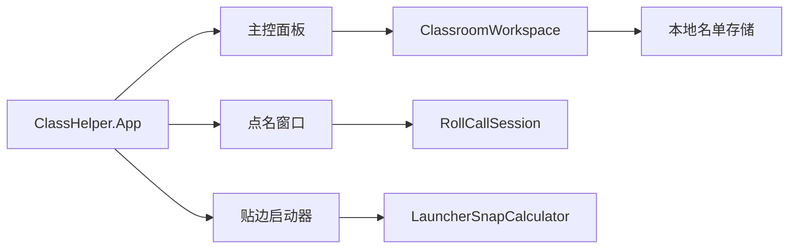

# 课堂助手技术设计

> 状态：已确认
> 更新日期：2026-08-08
> 适用范围：Windows 固定名单与随机点名工具

## 结论

采用 C#、.NET 10 LTS 和 WPF 构建 64 位 Windows 桌面应用。应用保持本地优先，不建设服务端、账户、云同步或遥测。

课程表、节假日、教学日历、顶部桌面栏和多屏课程展示已经移出本项目，由 ClassIsland 提供。ClassHelper 不与 ClassIsland 交换名单或课堂数据，也不依赖 ClassIsland 才能点名。

## 技术栈

| 关注点 | 选择 | 说明 |
|---|---|---|
| 语言与运行时 | C# 14、.NET 10、`win-x64` | Windows 专用，自包含发布 |
| 桌面 UI | WPF、XAML | 适合无边框置顶启动器和普通管理窗口 |
| UI 状态 | 轻量 MVVM | ViewModel 提供页面状态，抽取规则留在核心模块 |
| 本地数据 | 预览版 JSON，正式版 SQLite | 先验证体验，再迁移到整机共享数据目录 |
| 随机源 | `RandomNumberGenerator.GetInt32` | 独立随机和均衡轮选都使用系统密码学随机源选取索引 |
| Windows 集成 | WPF Window + HKCU Run | 启动器置顶、位置吸附和每用户自启 |
| 测试 | xUnit | 覆盖抽取策略与吸边算法 |
| 安装 | 后续使用 WiX MSI | 整机安装，运行时不提权 |

## 运行拓扑

一个 Windows 登录会话中只运行一个 ClassHelper 进程。进程包含三个窗口：

没有桌面顶部栏、课程窗口、日历窗口或后台网络服务。

## 模块设计

### RollCallSession

职责：

- 从固定名单中过滤启用成员；
- 执行独立随机；
- 执行一轮内不重复的均衡轮选；
- 抽完一轮后自动开始下一轮；
- 支持手动重置当前轮次。

抽取结果必须先确定，之后 UI 才播放揭晓动画。动画时间、窗口焦点或用户关闭动画都不能改变结果。

### LauncherSnapCalculator

职责：

- 根据启动器与屏幕工作区计算最近边缘；
- 将最终坐标限制在可见区域；
- 支持负坐标屏幕的纯算法测试。

首版窗口适配器只使用主屏工作区。后续多屏实现应继续复用纯算法，不把屏幕枚举放入 View。

### ClassroomWorkspace

职责：

- 向主控面板和点名窗口提供同一份固定名单；
- 保存名单变更；
- 通知窗口刷新摘要；
- 不暴露具体文件格式或数据库实现。

### AppController

职责：

- 创建并管理主控面板和唯一的贴边启动器；
- 按需创建点名窗口；
- 主控面板关闭后保持后台运行；
- 从启动器退出时统一关闭全部窗口。

## 数据设计

### 当前预览版

位置：`%LocalAppData%\ClassHelper\classroom.preview.json`

只保存固定名单：

- 稳定 ID；
- 姓名；
- 可选学号或座号；
- 是否参与点名。

写入采用“临时文件 + 同卷替换”，避免程序异常退出后留下半个 JSON 文件。

### 正式版

正式安装版迁移到 `%ProgramData%\ClassHelper\Data\classhelper.db`，使用 SQLite 保存共享固定名单；启动器位置和自启等个人偏好留在 `%LocalAppData%` 或 HKCU。

不为已移出的课程和日历功能创建数据库表。

## 窗口行为

### 快捷启动器

- `Topmost=true`；
- 不进入任务栏；
- 支持拖动；
- 松开鼠标后吸附最近边缘；
- 入口固定为点名、名单和主控；
- 右键菜单可以打开主控或退出应用。

### 主控面板

- 普通可调整 WPF 窗口；
- 包含总览、随机点名、固定名单、启动设置和关于；
- 关闭窗口只隐藏，不退出应用。

### 点名窗口

- 默认置顶并居中；
- 清楚展示当前模式、候选人数或本轮剩余人数；
- 支持切换模式、重置本轮和继续抽取。

## 自启

每用户自启写入：

`HKCU\Software\Microsoft\Windows\CurrentVersion\Run\ClassHelper`

默认关闭。正式安装版必须写入安装目录中的应用路径；开发构建只用于功能验证。

## 测试策略

- 独立随机允许连续重复；
- 均衡轮选一轮内不重复；
- 轮次耗尽后自动重开；
- 禁用成员不参与候选；
- 空名单不能启动会话；
- 启动器选择最近边缘；
- 坐标始终回到可见区域；
- 负坐标屏幕仍能计算位置；
- `--smoke-test` 加载全部 XAML 后立即退出。

## 实施顺序

1. 人工验收主控、启动器和点名窗口；
2. 增加名单删除和缺席临时排除；
3. 增加启动器位置持久化与多屏 DPI 处理；
4. 迁移到整机共享 SQLite；
5. 构建 WiX MSI 并验证安装、升级和卸载。

## 明确不引入

- 课程表、节次、教学日历和节假日更新；
- 顶部桌面课程栏或 WorkerW 桌面嵌入；
- ClassIsland 插件或数据耦合；
- ASP.NET Core、REST API、数据库服务器或 Docker；
- Electron、Tauri、MAUI、Avalonia 或 WinUI 3；
- 云遥测、崩溃自动上传或远程配置。
