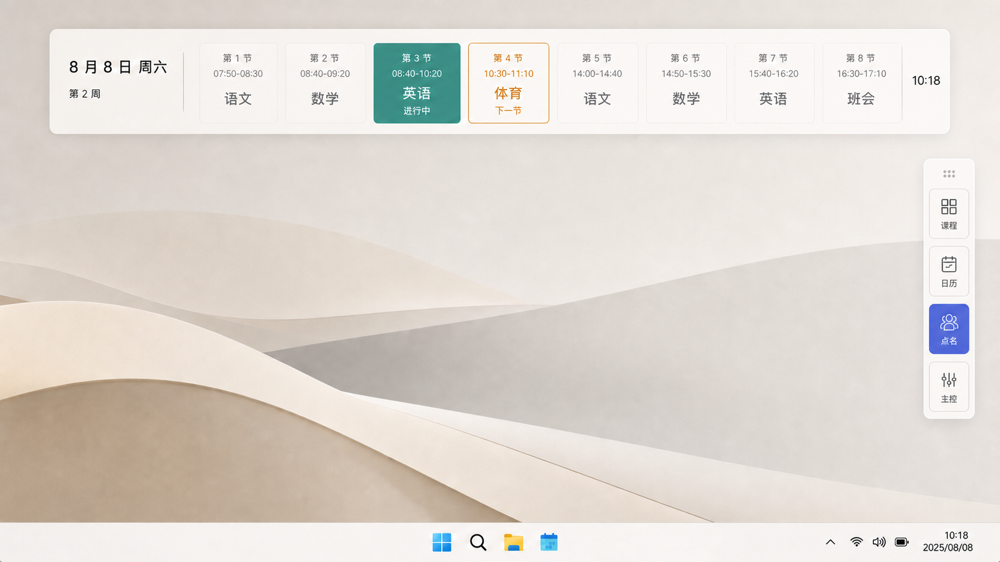
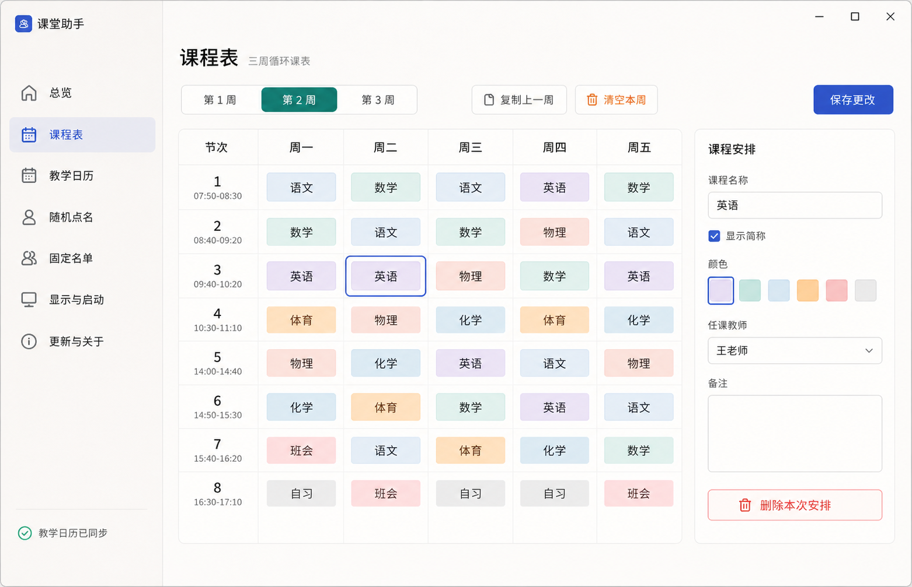
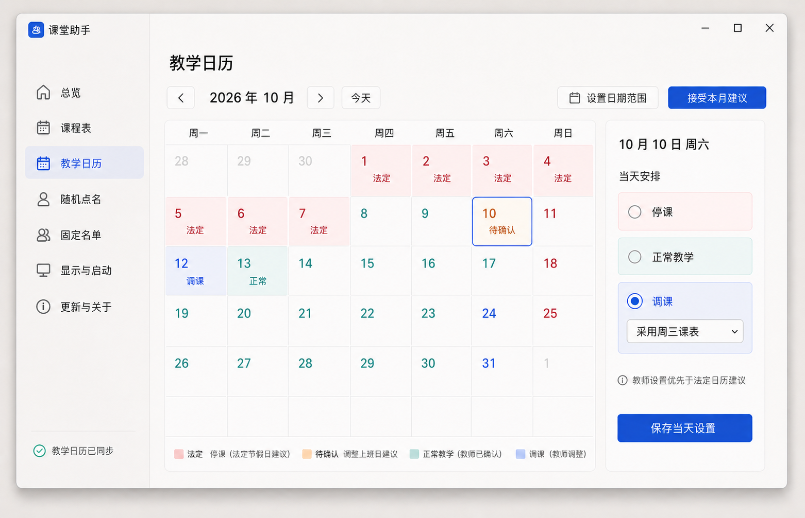
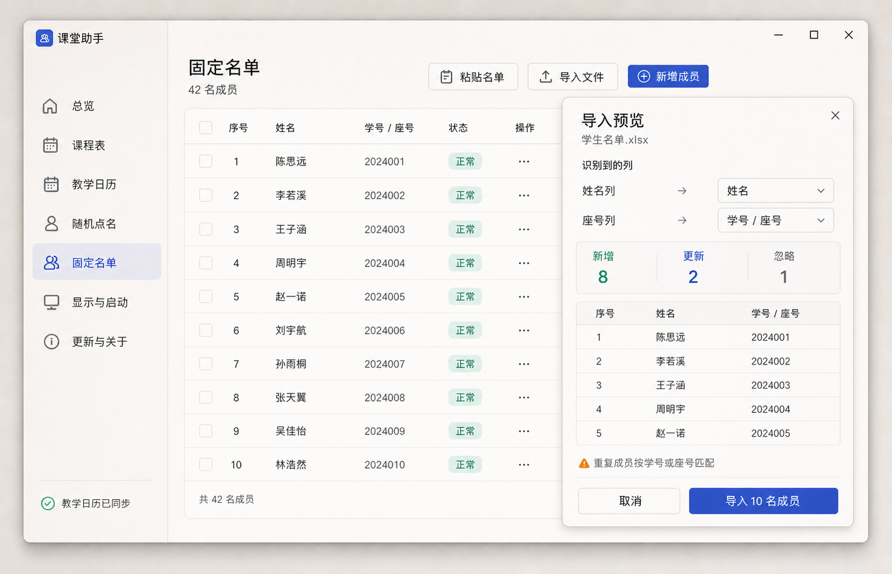
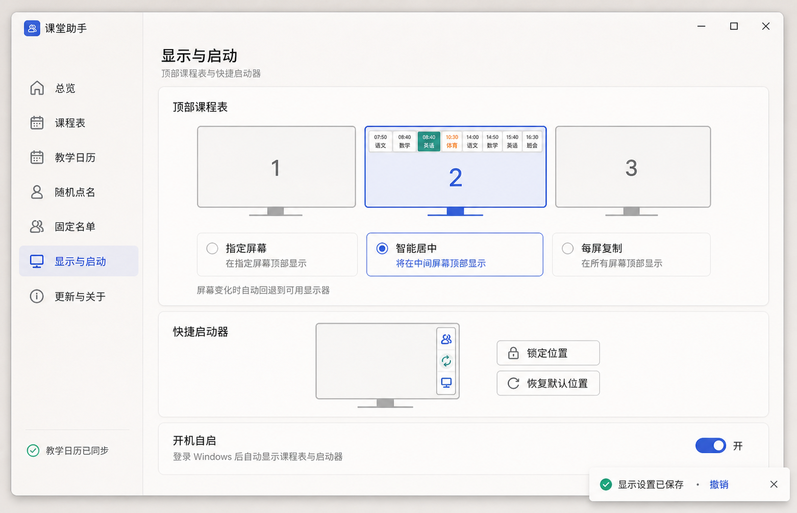
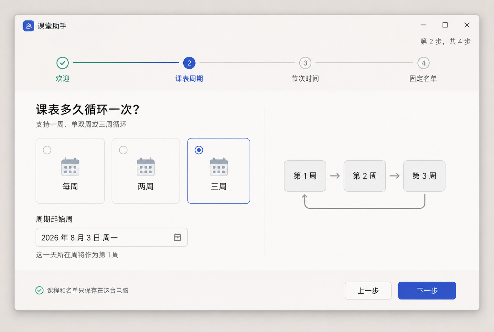

# UI/UX 高保真预览

这些预览由内置 Imagine 图像生成能力制作，用于审查视觉方向、层级与主要交互。它们不是最终 XAML 截图；若图片中的小字与 [UI/UX 设计规范](../ui-ux-spec.md) 冲突，以规范为准。

建议结合 [审查清单](../review-checklist.md) 按文件编号反馈。

## 01 · 桌面常驻态

顶部当天课程表、当前/下一节状态和置顶吸边启动器。

## 02 · 主控面板总览

今日课程时间轴、教学日历待办、固定名单和显示状态。

## 03 · 三周课程表编辑器

周期切换、课程网格、选中态和右侧课程检查器。

## 04 · 教学日历

2026 年 10 月国庆假期、调休待确认、教师调整和日期检查器。

## 05 · 固定名单与导入预览

名单表格、XLSX 列映射、变更统计和导入确认。

## 06 · 点名结果

均衡轮选、剩余人数、结果展示和后续操作。

## 07 · 显示与启动

指定屏幕、智能居中、每屏复制、启动器吸边和开机自启。

## 08 · 首次启动向导

四步向导中的课表周期与周期起始周设置。

